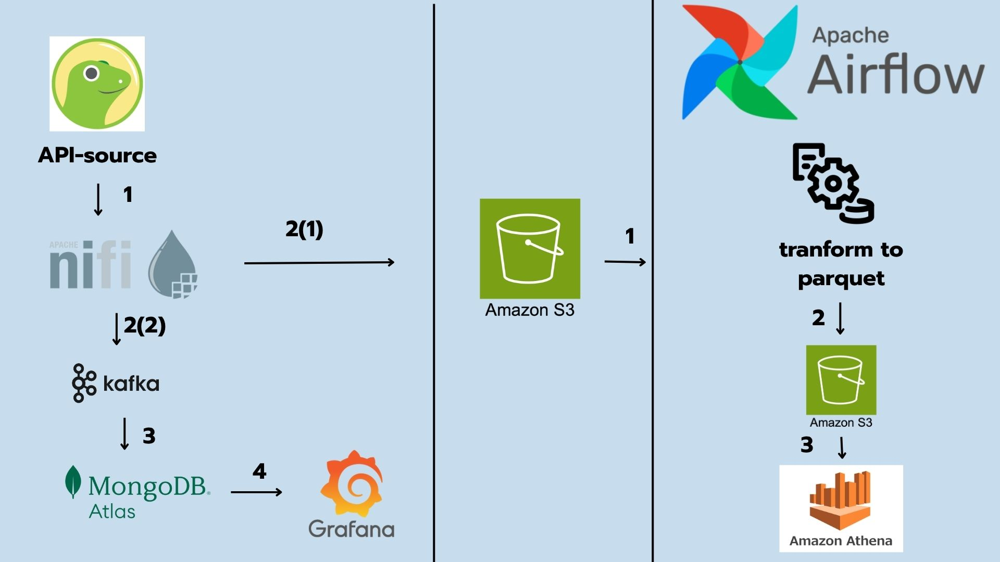

# 🚀 Crypto Data Pipeline 

A comprehensive real-time cryptocurrency data pipeline integrating **Apache Airflow**, **Apache NiFi**, **Kafka**, **MongoDB**, **S3**, and **Amazon Athena** for streaming analytics and business intelligence.

## 🏗️ Architecture Overview



### Data Flow
1. **Data Ingestion**: CoinGecko/CoinAPI → Apache NiFi
2. **Stream Processing**: Apache Kafka for real-time data distribution
3. **Real-time Storage**: MongoDB for live dashboards and alerts
4. **Analytics Storage**: Amazon S3 (Parquet format) for historical analysis
5. **Query Engine**: Amazon Athena for SQL-based analytics
6. **Orchestration**: Apache Airflow coordinates the entire pipeline

## 🎯 Features

### ✅ Core MVP Features
- **Real-time crypto price streaming** (5-minute intervals)
- **MongoDB storage** for real-time dashboards
- **S3 data lake** with Parquet format for analytics
- **Athena integration** for SQL queries
- **Airflow orchestration** with error handling
- **Kafka streaming** for scalable data distribution
- **Docker containerization** for easy deployment
- **Monitoring dashboards** with Grafana + Prometheus

### 🚀 Advanced Features
- **NiFi integration** for complex data transformations
- **Partitioned S3 storage** (year/month/day/hour)
- **Automatic schema evolution** with AWS Glue
- **Data retention policies** and cleanup
- **Multiple crypto API sources** with failover
- **Real-time alerting** for price movements
- **Performance metrics** and monitoring

## 📋 Prerequisites

- **Docker & Docker Compose** (v20.10+)
- **AWS Account** with S3 and Athena access
- **CoinGecko API Key** (free tier available)
- **8GB+ RAM** recommended for local development

## 🚀 Quick Start

### 1. Clone and Setup
```bash
git clone <repository-url>
cd crypto-data-pipeline

# Copy environment template
cp .env.example .env

# Edit environment variables
nano .env
```

### 2. Configure Environment Variables
Update `.env` with your credentials:
```bash
# Required
AWS_ACCESS_KEY_ID=your_aws_access_key
AWS_SECRET_ACCESS_KEY=your_aws_secret_key
AWS_S3_BUCKET_NAME=your-crypto-bucket
COINGECKO_API_KEY=your_coingecko_key

# Optional
CRYPTO_SYMBOLS=bitcoin,ethereum,cardano,polkadot,chainlink
```

### 3. Start the Pipeline
```bash
# Start all services
docker-compose up -d

# Check service status
docker-compose ps

# View logs
docker-compose logs -f airflow-webserver
```

### 4. Access Interfaces
- **Airflow UI**: http://localhost:8080 (admin/admin)
- **NiFi UI**: https://localhost:8443 (nifi/nifipassword)
- **Kafka UI**: http://localhost:8081
- **Grafana**: http://localhost:3000 (admin/admin)
- **MongoDB**: mongodb://localhost:27017

### 5. Run AWS Setup
```bash
# Setup S3 bucket and Athena database
docker-compose exec airflow-webserver python /opt/airflow/scripts/setup_aws.py
```

## 📊 Data Schema

### Crypto Price Data
```json
{
  "id": "bitcoin",
  "symbol": "BTC",
  "name": "Bitcoin",
  "current_price_usd": 45000.00,
  "market_cap_usd": 850000000000,
  "total_volume_usd": 15000000000,
  "price_change_percentage_24h": 2.5,
  "market_cap_rank": 1,
  "fetch_timestamp": "2025-01-15T10:30:00.000Z",
  "data_source": "coingecko"
}
```


## 📈 Monitoring

### Grafana Dashboards
1. **Real-time Crypto Prices**: Live price movements and market data
2. **Pipeline Metrics**: Airflow task success rates, processing times
3. **System Health**: Kafka lag, MongoDB performance, S3 upload status

### Alerts
- Price movement alerts (>10% change)
- Pipeline failure notifications
- Data freshness monitoring
- System resource alerts

## 🔍 Sample Analytics Queries

### Top Price Movers (24h)
```sql
SELECT symbol, name, current_price_usd, price_change_percentage_24h
FROM crypto_analytics.crypto_data
WHERE year = 2025 AND month = 1 AND day = 15
ORDER BY ABS(price_change_percentage_24h) DESC
LIMIT 10;
```

### Market Cap Distribution
```sql
SELECT 
  CASE 
    WHEN market_cap_usd < 1000000000 THEN 'Small Cap'
    WHEN market_cap_usd < 10000000000 THEN 'Mid Cap'
    ELSE 'Large Cap'
  END as market_cap_category,
  COUNT(*) as coin_count,
  SUM(market_cap_usd) as total_market_cap
FROM crypto_analytics.crypto_data
WHERE year = 2025 AND month = 1 AND day = 15
GROUP BY 1;
```

### Price Volatility Analysis
```sql
SELECT symbol,
       AVG(current_price_usd) as avg_price,
       STDDEV(current_price_usd) as price_volatility,
       (STDDEV(current_price_usd) / AVG(current_price_usd)) * 100 as volatility_percent
FROM crypto_analytics.crypto_data
WHERE year = 2025 AND month = 1 AND day >= 14
GROUP BY symbol
ORDER BY volatility_percent DESC;
```

## 🛠️ Development

### Local Development
```bash
# Install dependencies
pip install -r requirements.txt

# Run tests
pytest tests/

# Format code
black dags/ scripts/ kafka/

# Lint code
flake8 dags/ scripts/ kafka/
```

### Adding New Data Sources
1. Update `crypto_api.py` with new API client
2. Modify DAG to include new data source
3. Update MongoDB and S3 schemas if needed
4. Add new Athena views for the data

### Custom Transformations
1. Create new processor in `dags/utils/`
2. Add transformation task to DAG
3. Update Kafka topics if needed
4. Test with sample data


## 🔧 Troubleshooting

### Common Issues

#### 1. Services Not Starting
```bash
# Check service logs
docker-compose logs <service-name>

# Restart specific service
docker-compose restart <service-name>

# Check resource usage
docker stats
```

#### 2. Kafka Connection Issues
```bash
# Check Kafka topics
docker-compose exec kafka kafka-topics --list --bootstrap-server localhost:9092

# Create topics manually
docker-compose exec kafka kafka-topics --create --topic crypto-raw-data --partitions 3 --replication-factor 1 --bootstrap-server localhost:9092
```

#### 3. MongoDB Connection Problems
```bash
# Connect to MongoDB
docker-compose exec mongodb mongosh

# Check database status
use crypto_db
db.stats()
```

#### 4. AWS Permissions Issues
```bash
# Test AWS credentials
aws sts get-caller-identity

# Test S3 access
aws s3 ls s3://your-bucket-name

# Test Athena access
aws athena list-databases --catalog-name AwsDataCatalog
```

#### 5. Airflow DAG Issues
```bash
# Check DAG status
docker-compose exec airflow-webserver airflow dags list

# Test DAG parsing
docker-compose exec airflow-webserver airflow dags test crypto_data_pipeline 2025-01-15
```

### Data Privacy
- Encrypt data at rest in S3
- Use VPC endpoints for AWS services
- Implement data masking for sensitive fields


## 📝 License

This project is licensed under the MIT License - see the [LICENSE](LICENSE) file for details.

